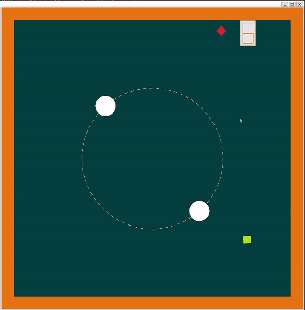

# Circle Rush Game

### Цель игры
Набрать как можно больше очков, собирая бонусные кубики и уклоняясь от убивающих. В игре вы управляете вращающимися кругами, меняя направление вращения.
В игре есть 3 типа кубиков:
- Бонусный - добавляет одно очко к счету
- Замораживающий - останавливает движение кругов на определенное время
- Убивающий - заканчивает игру

Кубы активируются при столкновении с кругами. Количество кругов, их характеристики, а также характеристики кубов можно настраивать. 
Есть динамическое усложнение игры, через выставление `dynamic_difficult = true` у класса `GameLogic`.
Все настройки выставляются в файле Game.cpp в методе initialize().

### Управление
- SPACE - изменение направления вращения на противоположное
- ENTER - перезапуск игры
- ESCAPE - закрытие игры

### Сборка
``sudo apt install g++ cmake libx11-dev`` \
``mkdir build && cd build`` \
``cmake -DCMAKE_BUILD_TYPE=Release ..`` \
``make``
